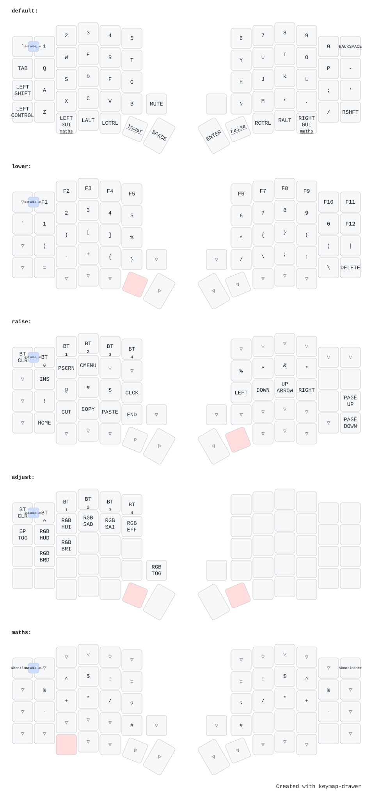

# ZMK Config

## Keymap

## Flashing after keymap changes

From [zmk-docs:cusomization](https://zmk.dev/docs/customization)

>
> For [split keyboards](https://zmk.dev/docs/features/split-keyboards#building-and-flashing-firmware), only the central (left) side will need to be reflashed if
> you are just updating your keymap. More troubleshooting information for split
> keyboards can be found [here](https://zmk.dev/docs/troubleshooting/connection-issues#split-keyboard-parts-unable-to-pair).
>

